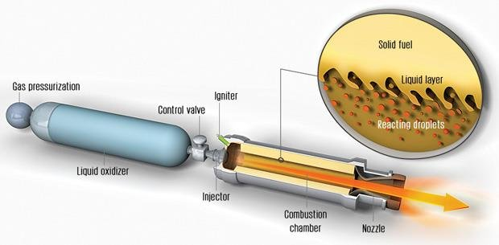
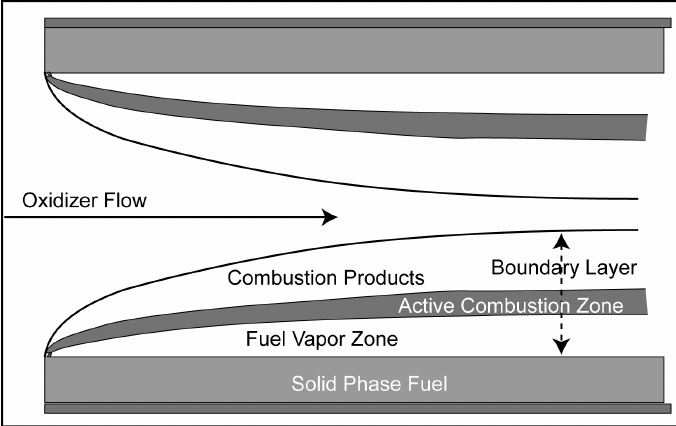
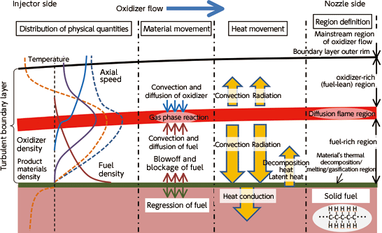

# Background on Hybrids

Due credit: this entire project is based on SPAD, "Space Propulsion Analysis and Design" by Ronald Humble. While this book is relatively hard to find online, Imperial's Library was able to find us a copy through its network of partner libraries.  Just put in a request at the library if you want a copy.

There are definitely more \(and possibly better\) resources, but Humble was rather easy to follow, and thus was implemented. Dont forget: the primary objective of this code is to be a guide. It is not the single source of truth. 

## Why is it called a 'hybrid'?

> A hybrid rocket stores propellant in two different states - liquid and solid.

\(Humble, SPAD, Ch. 7\)

Typically, we will see liquid oxidisers and solid fuels. When you allow this oxidiser to flow over the solid fuel, and introduce an ignition, they will burn together to make the rocket go. 

**Why use a hybrid?**

There are a few key benefits, including safety, throttling, an ability to restart, some robustness to solid grain manufacturing, and usually lower cost.

However they are also less capable of producing large amounts of thrust \(relative to similar scale solids or liquids\) and in general store less propellant in a similar scale solid or liquid engine. They are also rather tricky to design well because of something called OF shift. 

The full details of these are beyond the scope of this documentation - there are some far better resources to understand the trade offs between solids, liquids and hybrids \(and other forms of propulsion\) elsewhere.

**Typical Layout of a Hybrid Engine**

Here is a typical layout for a hybrid engine. Starting at the second tank from the left, you have a liquid oxidiser. This means that it is the source of oxygen for combustion to occur. It passes through a control valve \(a tap\) into the injector. The injector is meant to take the cold, high pressure liquid oxidiser and convert it into a gaseous form. There are many possible oxidiers, for instance Liquid Oxygen or Nitrous Oxide. 

The gaseous oxidiser then hits the combustion chamber, which is where \(as the name implies\) combustion takes place. For combustion, you need gaseous fuel to mix with gaseous oxidiser.  With a source of ignition, this mixture burns, and hopefully burns well. When it does so, it gains a lot of thermal energy. 

Hopefully, this hot energetic gas heads towards the botttom end, where it passes through a converging diverging nozzle. This means that the flow is squeezed into a smaller diameter, making it speed up. When it reaches the narrowest point, it is hopefully travelling at the speed of sound. Then something magical happens: if you squeeze it more, it actually slows down. So now you have to open up the diameter, which increases the speed of the flow. Now you have all the material that was initially inside the rocket being kicked back out of the rocket at a very high speed - at about 3km/s, or 10,800 km/h. This is what gives the rocket its kick to fly up. 

We skipped two important parts of the rocket: the igniter is a key component that kick starts the combustion process - remember we have gaseous oxidiser entering the combusion chamber, but we have solid fuel inside the combustion chamber. Try setting fire to a chunk of wax - it doesnt work. To light a candle, you need a wick, which takes the wax, and exposes a region to liquify and the become gaseous and sustain the flame. In a rocket engine, thats not enough - when we start the rocket engine we want it to really go. As such, we need an igniter. This has to create an extremely hot region that melts and then vaporises our solid fuel, pretty much instantly. Then, when the cold gaseous oxidiser hits this \(slightly\) hot gaseous wax, the igniter must provide EVEN more heat to cause them to combust. Once the combustion starts, hopefully,  the heat generated by combustion continues to melt new fuel and keep the combustion going. 

The last key component is the gas pressurization tank. If you didnt have this tank, the moment ignition starts, the pressure in the combustion chamber is going to shoot up. Now this high pressure gas wants to exit, and its not just going to try to go down. Its also going to try to go up - ie, into the oxidiser tank. That's bad. The easiest way to prevent this _and_ keep oxidiser flowing into the combustion chamber is to make the oxidiser tank pressure even higher than that of the combustion products. As such, we use a tank of very highly pressured gas to maintain a large pressure on the liquid oxidier and keep it flowing down. Alternatively, \(especially when this is infeasible for  huge rockets\), use a pump to provide this pressure.

However thats a lot of tanks and fittings and complexity. To simplify the set up, hybrids often use a oxidiser that is 'self-pressurising.' To understand this, first think of a closed tank with some water inside it. How much does the water want to leave the tank? Its the air pressure above the tank + the weight of the water that will cause the water to drain. However with a self-pressurising liquid, the liquid really wnats to evaporate. It evaporates enough to pressurise the non-liquid volume thats inside the table. As such, the pressure at the bottom is much higher that just atmospheric pressure and the weight of the liquid. One such oxidiser is nitrous oxide, which has a self-pressure of about 35 bars at ~room temperature. As the oxidiser pressurises itself, we dont need an additional pressurising tank to keep the combustion in the combustion chamber. 


Propellant _always_ refers to the _combination_ of both the fuel and the oxidiser. Fuel and  propellant are _not_ interchangable words.


## Hybrid Dynamics

What happens inside a hybrid motor? 

In the simplest form, the combustion chamber has fuel as a ring on the outside, and the middle is empty, for combustion to occur in. 


This middle region is called the combustion chamber 'port'


Starting from the outside \(bottom in the above figure\), you have the outer wall of the rocket engine and the solid fuel. This solid fuel is evaporating, forming the fuel vapour zone. It then hits the oxidiser and there is active combustion, where the heat is actually being produced. The combustion products continue down the rocket and radially inwards. 

This all happens within a boundary layer, and naturally this is all a rather complicated process. Here is a less summarized image of whats happening inside the engine:

All of this complexity can be modelled... with great difficulty \(see Chiaverini's book on Hybrids\)


Instead we simplify all this into an empirical formula


## Hybrid Dynamics Approximated

To determine the thrust of the rocket, we need to know much stuff is leaving the rocket, and at what speed:

$$
F = \dot m c
$$

where 

* F is the thrust \(units of Newtons\),
* $$\dot m$$is the mass flow rate \(units of kg/s\). The dot above the $$m$$ means that it is a time derivative. 
* $$c$$ is the exhaust speed, the speed at which stuff is leaving the rocket \(units of m/s\)

How fast stuff leaves,$$c$$, is dependent on the pressure in the combustion chamber. This depends on how much stuff there is in the combustion chamber during the combustion. 

How much stuff leaves, $$\dot m$$, is equal to amount of oxidiser leaving plus the amount of fuel leaving. 

As is now obvious, it is _very_ important for hybrids to measure how much oxidiser enters \(and therefore leaves\) the combustion chambger, AND how much fuel evaporates \(and therefore leaves\) the combustion chamber. 

The key empirical relationship is

$$
\dot r = a G^n L^m
$$

where

* $$ \dot r$$ is the regression rate \(m/s\), and tells you how fast the solid surface receeds due to evaporation. 
* $$G$$is the oxidiser mass-flux rate \(mass of oxidiser passing through 1 meter square of area per second, units = $$kg \cdot  m^{-2} \cdot s^{-1}$$ \) in the combustion chamber port
* $$L$$ is the length of the combustion chamber \(m\)
* $$a$$, $$m$$ and $$n$$ are empirical constants that can be found through experiments. These are often called the 'regression coefficients.'


Be extremely careful about the units used in this equation. Most sources of experimental data do a remarkably bad job of reporting the units they used in computing the regression coefficients. Roar always assumes SI units.


Using this regression estimate, you can figure out how much \(and how fast\) the solid fuel is being converted into gas and burning, and therefore estimate the pressure in the chamber. 

There are many other \(similar\) empirical relationships that take different factors into account. See the section on regression rates for more details on regression rates.



## Sizing Overview

Humble provided a very good table that laid out how the hybrids rockets can be sized. It is repeated here \(with minor modifications\). 

<table>
  <thead>
    <tr>
      <th style="text-align:left">Step</th>
      <th style="text-align:left">Action</th>
      <th style="text-align:left">Steps</th>
    </tr>
  </thead>
  <tbody>
    <tr>
      <td style="text-align:left">1 - Define Requirements</td>
      <td style="text-align:left">Summarise</td>
      <td style="text-align:left">
        <ul>
          <li>Define performance requirements</li>
          <li>Define constraints</li>
          <li>Define mass requirements</li>
          <li>Define thrust requirements</li>
          <li>Define the &apos;ilities&apos;</li>
        </ul>
      </td>
    </tr>
    <tr>
      <td style="text-align:left">2 - Make a preliminary design</td>
      <td style="text-align:left">Choose Propellants</td>
      <td style="text-align:left">
        <ul>
          <li>Evaluate the thermochemistry of the chosen propellants</li>
          <li>Choose design O/F ratio and range of O/F ratios</li>
          <li>Consider environmental and performance requirements</li>
        </ul>
      </td>
    </tr>
    <tr>
      <td style="text-align:left"></td>
      <td style="text-align:left">Determine pressure levels in system</td>
      <td style="text-align:left">
        <ul>
          <li>Choose whether to use a pump or a pressure fed system</li>
          <li>Choose a combustion chamber pressure and the nozzle expansion ratio</li>
          <li>Determine pressure drop across your components (for instance injector,
            valves, pipes etc)</li>
          <li>Determine the dynamic pressure in the system (due to moving liquids and
            gases around)</li>
          <li>Determine the required oxidiser tank pressure</li>
          <li>Deteremine the pressurizing system</li>
        </ul>
      </td>
    </tr>
    <tr>
      <td style="text-align:left"></td>
      <td style="text-align:left">Determine requirements for initial propellant flow</td>
      <td style="text-align:left">
        <ul>
          <li>Estimate initial specific impulse</li>
          <li>Determine required flow rates based on required thrust level</li>
        </ul>
      </td>
    </tr>
    <tr>
      <td style="text-align:left"></td>
      <td style="text-align:left">Size the system</td>
      <td style="text-align:left">
        <ul>
          <li>Choose inert mass fraction</li>
          <li>Use the rocket equation to determine the total mass of propellant required</li>
          <li>Estimate the fuel and oxidiser mass</li>
          <li>Estimate the inert mass of the rocket</li>
        </ul>
      </td>
    </tr>
    <tr>
      <td style="text-align:left"></td>
      <td style="text-align:left">Configure the combustion chamber</td>
      <td style="text-align:left">
        <ul>
          <li>Choose the number of ports</li>
          <li>Choose the port cross section and length and web thicknesses</li>
        </ul>
      </td>
    </tr>
    <tr>
      <td style="text-align:left">3 - Estimate Performance</td>
      <td style="text-align:left">Simulate the burn</td>
      <td style="text-align:left">
        <ul>
          <li>Estimate the operating parameters over the duration of the burn (thrust,
            pressures, temperatures, ...)</li>
        </ul>
      </td>
    </tr>
    <tr>
      <td style="text-align:left">4 - Detailed sizing</td>
      <td style="text-align:left">Nozzle</td>
      <td style="text-align:left">
        <ul>
          <li>The characteristic velocity of the propellants determines the throat area</li>
          <li>Chosen expansion ratio determines the size of the exit</li>
          <li>Choose how long the nozzle is (Make the nozzle longer for more efficiency,
            but greater mass and cost)</li>
        </ul>
      </td>
    </tr>
    <tr>
      <td style="text-align:left"></td>
      <td style="text-align:left">Combustion Chamber</td>
      <td style="text-align:left">
        <ul>
          <li>Choose length of fore and aft sections</li>
          <li>Choose material</li>
          <li>Stress analysis of the combustion chamber determines wall thickness</li>
        </ul>
      </td>
    </tr>
    <tr>
      <td style="text-align:left"></td>
      <td style="text-align:left">Oxidiser Tank</td>
      <td style="text-align:left">
        <ul>
          <li>Determine length based on required volume of oxidiser</li>
          <li>Choose material</li>
          <li>Stress analysis determines the wall thickness</li>
        </ul>
      </td>
    </tr>
    <tr>
      <td style="text-align:left"></td>
      <td style="text-align:left">Pressurant System</td>
      <td style="text-align:left">
        <ul>
          <li>Design pressurant system (as needed)</li>
        </ul>
      </td>
    </tr>
    <tr>
      <td style="text-align:left"></td>
      <td style="text-align:left">Extra stuff</td>
      <td style="text-align:left">Structural components, pipes, vales etc</td>
    </tr>
    <tr>
      <td style="text-align:left">5 - Iterate</td>
      <td style="text-align:left">Loop</td>
      <td style="text-align:left">
        <ul>
          <li>Iterate the design as needed</li>
          <li>Can/should be performed between any of the above steps.</li>
        </ul>
      </td>
    </tr>
    <tr>
      <td style="text-align:left">6 - Build</td>
      <td style="text-align:left"></td>
      <td style="text-align:left"></td>
    </tr>
  </tbody>
</table>

\[Table 7.7, SPAD Humble\]


Roar attempts to automate \(most of\) steps 2 and 3. The rest of the steps are still needed to make the rocket work.


See the page on sizing to see the steps and the equations used in detail. The steps are slightly different, in order to fufill the needs of Imperial College London Rocketry. 



## New Developments

There are some seriously awesome new updates also coming to how Hybrids work. For instance, see the following slide deck for incredible 3D printed hybrids in ABS. 



This sizing code \(as it stands\) does not compute stuff as complicated as this. 

## Jump to getting started



